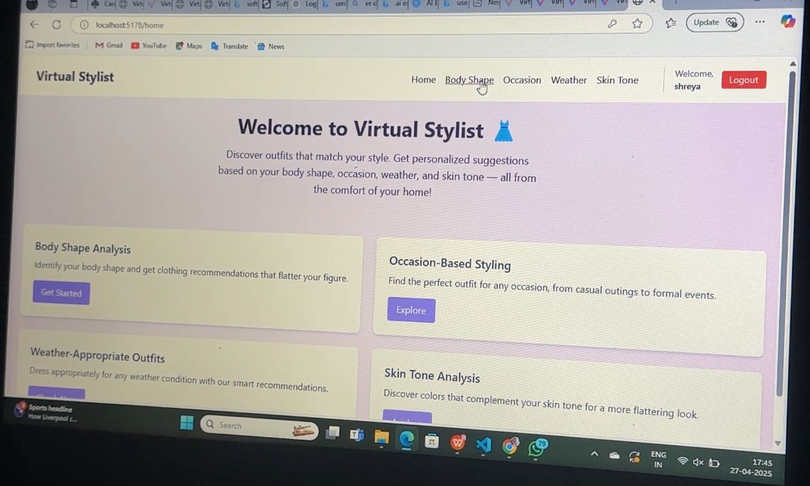
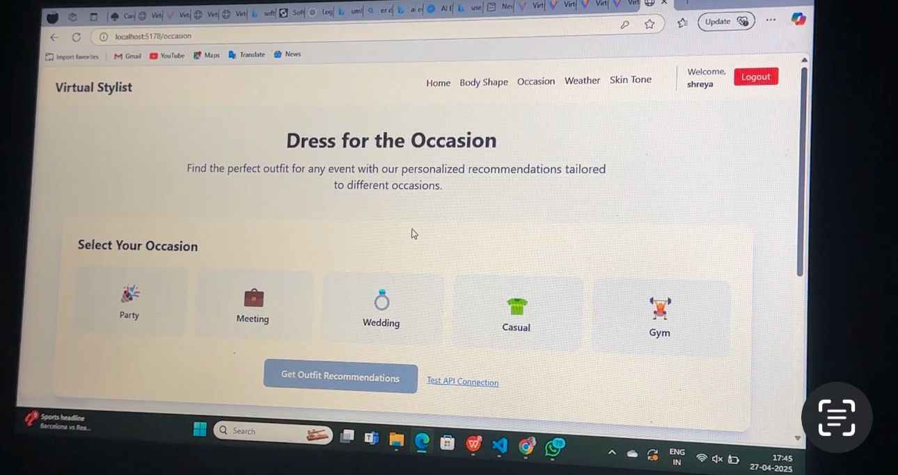
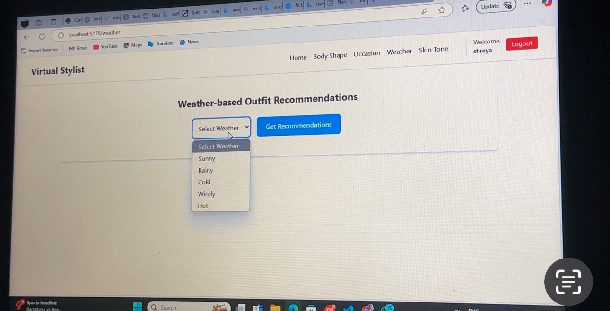
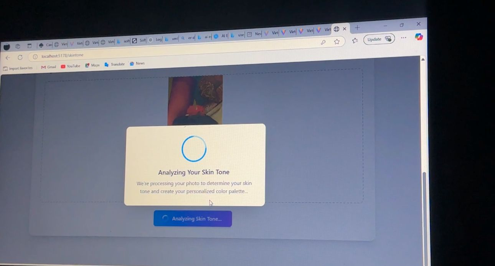
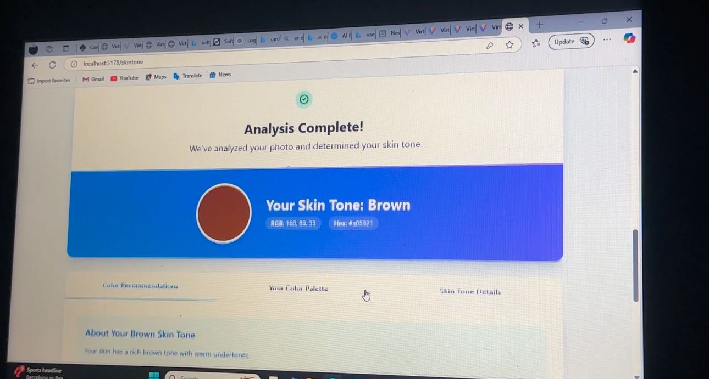
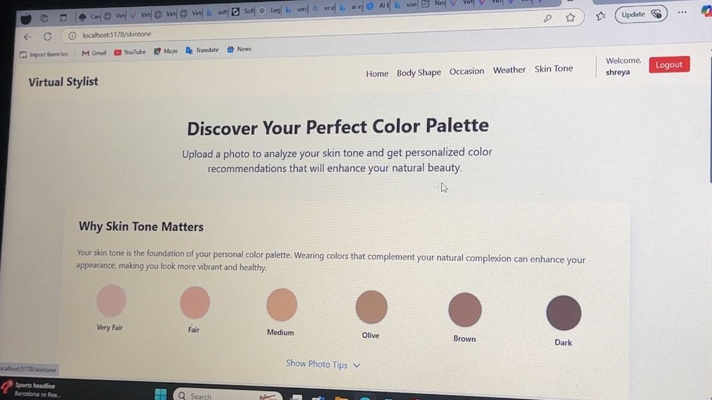
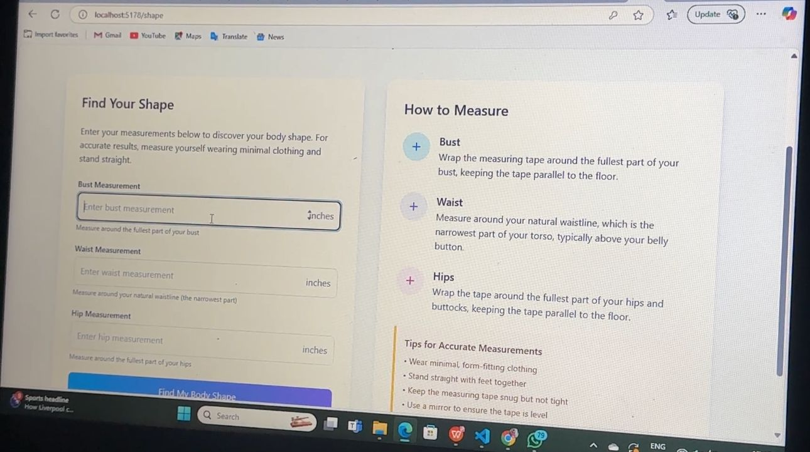

# Virtual Stylist AI 👗🧠

An AI-powered virtual stylist web app that recommends personalized outfit suggestions based on **body shape**, **skin tone**, **occasion**, and **weather**.

---

###  Tech Stack

- **Frontend:** React.js, Tailwind CSS, Vite
- **Backend:** Node.js, Express.js, Python
- **Authentication & Storage:** Firebase
- **AI & ML:** Custom Python scripts, Replicate API
- **APIs Used:** OpenWeatherMap (for weather), Replicate (FashionCLIP, YOLOv8), Google Vision

---

###  Key Features

✅ **Body Shape-Based Suggestions**
- User inputs bust, waist, hip size or uploads an image
- Classifies into Apple, Pear, Hourglass, etc.
- Recommends ideal outfit types per body shape

✅ **Skin Tone Detection**
- Upload face image → detects tone (Fair, Medium, Dark)
- Suggests matching color palettes and outfits

✅ **Occasion-Based Outfits**
- Choose from Casual, Party, Formal, Traditional
- Gets curated outfit recommendations

✅ **Weather-Based Styling**
- Auto-fetches current weather
- Shows comfy outfits based on temperature & conditions

✅ **Image Upload + Preview**
- Users can upload photos to try features
- Previews are visible before submission

---

###  AI Implementation

- **YOLOv8 (Pose)** for body shape detection
- **Replicate’s FashionCLIP** for outfit mapping
- **Custom Python scripts** for ML logic
- **TensorFlow + Matplotlib** used for model testing (demo notebook)

---

### 📁 Folder Structure
Virtual-stylist-AI/
├── frontend/ # React app with Tailwind, routing, Firebase
├── backend/ # Node server, AI scripts, Python models!
├── README.md # You're here!

## 📸 Screenshots

###  Home Page

###  Outfit Recommendations

###  Weather-Based Recommendation

###  Skin Tone Detection
  
  

###  Body Shape

